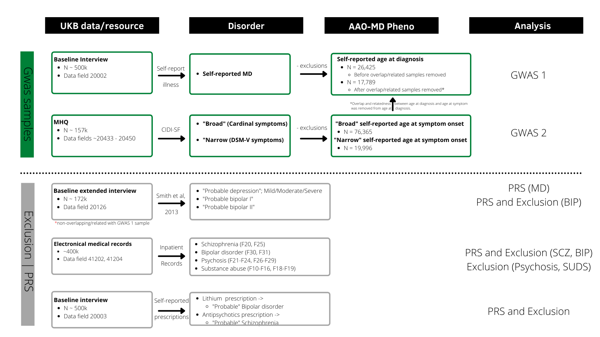

# Introduction
## This repository contains the code for the paper:
## Genetics of age-at-onset in major depression

Arvid Harder(1), Thuy-Dung Nguyen(1,2), Joëlle Pasman(1), Miriam A. Mosing(1,3), Sara Hägg(1) ,Yi Lu(1,2) 
1Department of Medical epidemiology and Biostatistics, Karolinska Institutet, Stockholm, Sweden.

1.	Department of Medical Epidemiology and Biostatistics, Karolinska Institutet, Stockholm, Sweden
2.	Department of Global Public Health, Karolinska Institute, Stockholm, Sweden
3.	Melbourne School of Psychological Sciences, Faculty for Medicine, Dentistry and Health Sciences, University of Melbourne, Australia. 

# Abstract
Major depression (MD) is a complex, heterogenous neuropsychiatric disorder. An early age at onset of major depression (AAO-MD) has been associated with more severe illness, psychosis, and suicidality. However, not much is known about what contributes to individual variation in this important clinical characteristic. This study sought to investigate the genetic components underlying AAO-MD. To investigate the genetics of AAO-MD, we conducted a genome-wide association meta-analysis of AAO-MD based on self-reported age of symptoms onset and self-reported age at first diagnosis from the UK Biobank cohort (total N = 94 154). We examined the genetic relationship between AAO-MD and five other psychiatric disorders. Polygenic risk scores were derived and used to predict five psychiatric outcomes and AAO-MD in independent sub-samples. We found a small but significant SNP-heritability (~6 %) for the AAO-MD phenotype. No SNP or gene reached SNP or gene level significance. We found evidence that AAO-MD has genetic overlap with MD risk (r_g = -0.49). Similarly, we found shared genetic risks between AAO-MD and autism-spectrum disorder, schizophrenia, bipolar disorder, anorexia nervosa (r_g range: -0.3 to -0.5). Polygenic risk scores for AAO-MD predicted MD, schizophrenia, and bipolar disorder, and AAO-MD was in turn predicted by polygenic risk scores derived from these disorders. Our results indicate that AAO-MD is heritable and there is a inverse genetic relationship between AAO-MD and both major depression and other psychiatric disorders. These findings suggest that the genetics of AAO-MD contribute to the shared genetic architecture observed between psychiatric disorders.

# Analysis description

Our analysis of age at onset in major depression was done using the UK Biobank. We provide a documentation of code [here](scripts). 

## Figure 1: Analysis in UK Biobank

